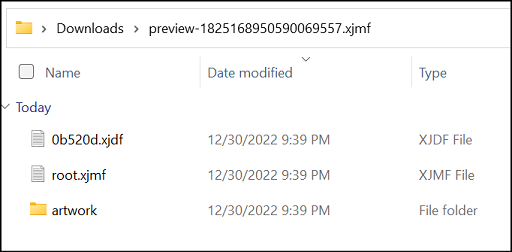

# CIP4 XJDF Java Library
 [](https://maven-badges.herokuapp.com/maven-central/org.cip4.lib.xjdf/xJdfLib) [](https://github.com/cip4/xJdfLib/blob/master/LICENSE.md)

XJDF (or JDF 2.0) no longer attempts to model the entire job as one large "job ticket"
but instead specifies a data interchange format between two applications that are assumed 
to have an internal data model that is not necessarily based on JDF. Thus each XJDF document 
defines a single transaction between two parties. A single job may be modeled as one or more XJDF transactions.

This fact required a conceptual change of the JDF libraries as
well. Among other things, the focus of JDF libraries is dealing with
giant XML files (XML files were used as data storage), managing
concurrency file access (spawn and merge), and handling workflow
logic (references). Also, ubiquitous XML
functionalities are implemented, like creating Java objects from XSD Schema, etc., because of the library's age.

Due to the significant structural improvements from JDF to XJDF, we also discussed the option of redesigning the 
libraries. The idea was to take the simplification concepts of XJDF and support them with a well-designed and lightwight library to make them more accessible to developers. This principle is precisely the intention behind the CIP4 XJDF Library ("xJdfLib").

 
 ## Quick Start
Before start using the xJdfLib to generate XJDF/XJMF's the constants DEVICE_ID, AGENT_NAME, and AGENT_VERSION 
must be initialized with the appropriate values. These attributes must be initialized once on application start:

```java
XJdfConstants.AGENT_NAME = "PreviewService";
XJdfConstants.AGENT_VERSION = "1.2.34";
XJdfConstants.DEVICE_ID = "PREVIEW_SERVICE";
```
These values are taken to create common default elements such as Headers or AuditCreated.


### Example: Creation XJMF Command SubmitQueueEntry
The following example illustrates how to create a CommandSubmitQueueEntry message using the xJdfLib.

**XJMF Message:**
```xml
<?xml version="1.0" encoding="UTF-8" standalone="yes"?>
<!-- Generated by CIP4 xJdfLib 2.1.x-DEV -->
<XJMF Version="2.1" xmlns="http://www.CIP4.org/JDFSchema_2_0">
  <Header AgentName="PreviewService" AgentVersion="1.2.34" DeviceID="PREVIEW_SERVICE" Time="2022-12-29T14:33:54.516+01:00"/>
    <CommandSubmitQueueEntry>
      <Header AgentName="PreviewService" AgentVersion="1.2.34" DeviceID="PREVIEW_SERVICE" Time="2022-12-29T14:33:54.516+01:00"/>
    <QueueSubmissionParams URL="https://example.org/my-job.xjdf"/>
  </CommandSubmitQueueEntry>
</XJMF>
```
**Code Snippet:**
```java
XJmfMessage xJmfMessage = new XJmfMessage();
xJmfMessage.addMessage(
    new CommandSubmitQueueEntry().withQueueSubmissionParams(
        new QueueSubmissionParams()
            .withURL(new URI("https://example.org/my-job.xjdf"))
    )
);

byte[] bytes = xJmfMessage.toXml();
```

The XJMF root node as well as the headers have been generated automatically by XJmfMessage class. The values of
AgentName, AgentVersion, and DeviceID have been taken from the constants. The only manual work was the definition of 
the specific message "CommandSubmitQueueEntry".

### Example: Read XJMF Command SubmitQueueEntry
The following example shows how to extract the //QueueSubmissionParams/@URL attribute value from the 
CommandSubmitQueueEntry XJMF Message:

**XJMF Message:**
```xml
<?xml version="1.0" encoding="UTF-8" standalone="yes"?>
<!-- Generated by CIP4 xJdfLib 2.1.x-DEV -->
<XJMF Version="2.1" xmlns="http://www.CIP4.org/JDFSchema_2_0">
  <Header AgentName="PreviewService" AgentVersion="1.2.34" DeviceID="PREVIEW_SERVICE" Time="2022-12-29T14:33:54.516+01:00"/>
    <CommandSubmitQueueEntry>
      <Header AgentName="PreviewService" AgentVersion="1.2.34" DeviceID="PREVIEW_SERVICE" Time="2022-12-29T14:33:54.516+01:00"/>
    <QueueSubmissionParams URL="https://example.org/my-job.xjdf"/>
  </CommandSubmitQueueEntry>
</XJMF>
```

**Code Snippet:**
```java
byte[] xJmfBytes = ...;

XJmfMessage xJmfMessage = new XJmfMessage(xJmfBytes);
Message message = xJmfMessage.getMessages().get(0); // simplification which assumes exactly ONE message.

if(message instanceof CommandSubmitQueueEntry) {
    CommandSubmitQueueEntry commandSubmitQueueEntry = (CommandSubmitQueueEntry) message;
    URI url = commandSubmitQueueEntry.getQueueSubmissionParams().getURL();
    
    String path = url.getUri().getPath();
}

```
The byte array is parsed by the XJmfMessage class. A list of all messages contained by the XJMF root element is 
returned by the xJmfMessage.getMessages() method.

At some point the generic message element needs to be cast to the specific message (here: CommandSubmitQueueEntry).
Once cast, all attributes and elements are accessible using concrete java objects.

### Example: Creation of an XJDF Document
The following XJDF Document contains the requried base attributes /XJDF/@JobID and and /XJDF/@Types, an AuditPool and a 
single Preview resource.

**XJDF Document:**
```xml
<?xml version="1.0" encoding="UTF-8" standalone="yes"?>
<!-- Generated by CIP4 xJdfLib 2.1.x-DEV -->
<XJDF JobID="42" Types="Interpreting Rendering PreviewGeneration" Version="2.1" xmlns="http://www.CIP4.org/JDFSchema_2_0">
    <AuditPool>
        <AuditCreated>
            <Header AgentName="PreviewService" AgentVersion="1.2.34" DeviceID="PREVIEW_SERVICE" Time="2022-12-29T21:03:04.416+01:00"/>
        </AuditCreated>
    </AuditPool>
    <ResourceSet Name="Preview" Usage="Output">
        <Resource>
            <Preview PreviewFileType="PNG">
                <FileSpec URL="preview.png"/>
            </Preview>
        </Resource>
    </ResourceSet>
</XJDF>
```

**Code Snippet:**
```java
XJdfDocument xJdfDocument = new XJdfDocument("42", "Interpreting",  "Rendering", "PreviewGeneration");
xJdfDocument.addResourceSet(
    new Preview()
        .withPreviewFileType(Preview.PreviewFileType.PNG)
        .withFileSpec(new FileSpec().withURL(uriPreview)),
    ResourceSet.Usage.OUTPUT
);
byte[] bytes = xJdfDocument.toXml();
```
The requried base attributes /XJDF/@JobID and and /XJDF/@Types are set in the constructor of XJdfDocument. The AuditPool
will be generated automatically based on the XJdfConstants values.

The only manual work is the definition of the specific resource.


### Example: Creation of a CommandSubmitQueueEntry XJMF Zip Package
**XJMF CommandSubmitQueueEntry (root.xjmf):**
```xml
<?xml version="1.0" encoding="UTF-8" standalone="yes"?>
<!-- Generated by CIP4 xJdfLib 2.1.x-DEV -->
<XJMF Version="2.1" xmlns="http://www.CIP4.org/JDFSchema_2_0">
    <Header AgentName="PreviewService" AgentVersion="1.2.34" DeviceID="PREVIEW_SERVICE" Time="2022-12-30T21:39:10.825+01:00"/>
    <CommandSubmitQueueEntry>
        <Header AgentName="PreviewService" AgentVersion="1.2.34" DeviceID="PREVIEW_SERVICE" Time="2022-12-30T21:39:10.825+01:00"/>
        <QueueSubmissionParams URL="0b520d.xjdf"/>
    </CommandSubmitQueueEntry>
</XJMF>
```
**XJDF Document (0b520d.xjdf):**  
The XJDF Document referred by the previous XJMF Message CommandSubmitQueueEntry (see //CommandSubmitQueueEntry/QueueSubmissionParams/@URL)

```xml
<?xml version="1.0" encoding="UTF-8" standalone="yes"?>
<!-- Generated by CIP4 xJdfLib 2.1.x-DEV -->
<XJDF JobID="0b520d" Types="PreviewGeneration" Version="2.1" xmlns="http://www.CIP4.org/JDFSchema_2_0">
    <AuditPool>
        <AuditCreated>
            <Header AgentName="PreviewService" AgentVersion="1.2.34" DeviceID="PREVIEW_SERVICE" Time="2022-12-30T21:39:10.823+01:00"/>
        </AuditCreated>
    </AuditPool>
    <ResourceSet Name="RunList" Usage="Input">
        <Resource>
            <RunList>
                <FileSpec URL="artwork/my-artwork.pdf"/>
            </RunList>
        </Resource>
    </ResourceSet>
    <ResourceSet Name="PreviewGenerationParams" Usage="Input">
        <Resource>
            <PreviewGenerationParams Resolution="72.000 72.000"/>
        </Resource>
    </ResourceSet>
</XJDF>
```
**Content Zip Package:**  
This is a screenshot of the ZIP Packages' internal file structure:  


**Code Snippet:**  
This is the code required to create the full zip package:
```java
// load artwork
byte[] artwork = ...;
URI artworkUri = new URI("artwork/my-artwork.pdf");

// create XJDF Document
String jobId = UUID.randomUUID().toString().substring(0, 6);

XJdfDocument xJdfDocument = new XJdfDocument(jobId, "PreviewGeneration");
xJdfDocument.addResourceSet(
        new RunList().withFileSpec(new FileSpec().withURL(artworkUri)),
        ResourceSet.Usage.INPUT
);
xJdfDocument.addResourceSet(
        new PreviewGenerationParams().withResolution(new XYPair(72f, 72f)),
        ResourceSet.Usage.INPUT
);
URI xJdfDocumentUri = new URI(jobId + ".xjdf");

// create CommandSubmitQueueEntry XJMF Message
XJmfMessage xJmfMessage = new XJmfMessage();
xJmfMessage.addMessage(
        new CommandSubmitQueueEntry().withQueueSubmissionParams(new QueueSubmissionParams().withURL(xJdfDocumentUri))
);

// create and return zip package
byte[] zipPackage = ZipPackage.Builder()
        .withXJmfRoot(xJmfMessage)
        .withXJdfDocument(xJdfDocumentUri, xJdfDocument)
        .withFile(artworkUri, artwork)
        .build()
        .packageFiles();
```


## Distribution
The library is distributed using the Maven Central Repository:   
https://search.maven.org/artifact/org.cip4.lib.xjdf/xJdfLib


### Installation
The xJdfLib requires the jakarta.xml.bind-api being implemented in your project:

Here is an example how to include xJdfLib in Gradle:
```
dependencies {
    implementation 'org.cip4.lib.xjdf:xJdfLib:+'
    implementation 'jakarta.xml.bind:jakarta.xml.bind-api:+'
}
```
 

 ## Issue Tracking
Here is the link to the CIP4 JIRA Project:  
https://cip4.atlassian.net/browse/XJDFLIB


## Development Notes
### Release a new Version
Creation and publishing of a new version to GitHub Release and to the Central Maven Repository.  
**NOTE:** The publication to the Central Maven Repository may take up to two hours.

```bash
$ git tag -a [VERSION] -m "[TITLE]"
$ git push origin [VERSION]
```

In case a build has been failed, a tag can be deleted using the following command:
```bash
$ git tag -d [VERSION]
$ git push origin :refs/tags/[VERSION]
```